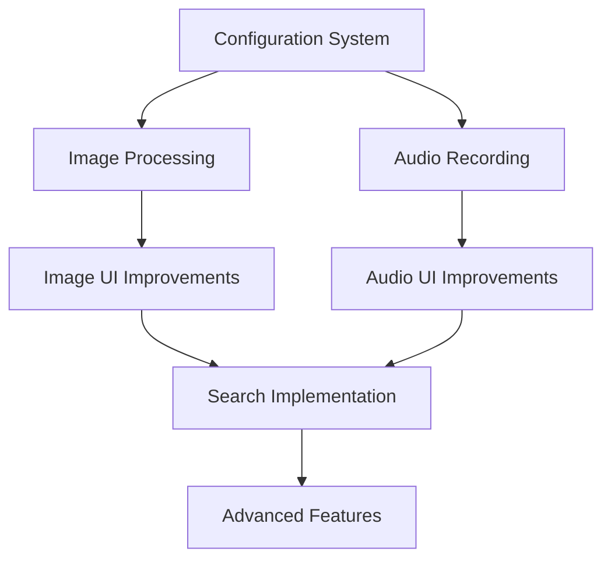

# Timeline Notes - Development Roadmap

## Memory Management

### URL Object Lifecycle Management
Memory leaks are a common issue in web applications, especially when dealing with media files. The URL Manager provides a centralized system for creating, tracking, and cleaning up URL objects created by URL.createObjectURL(). This is crucial for preventing memory leaks when displaying images, audio, or other blob data.

Key features:
- Automatic tracking of created URLs
- Context-aware URL management
- Automatic cleanup of stale URLs
- Development monitoring tools

```javascript
class URLManager {
  constructor() {
    this.activeURLs = new Map(); // Map<string, { url: string, createdAt: Date }>
  }

  createURL(blob, context = 'default') {
    const url = URL.createObjectURL(blob);
    this.activeURLs.set(url, {
      context,
      createdAt: new Date()
    });
    return url;
  }

  revokeURL(url) {
    if (url && this.activeURLs.has(url)) {
      URL.revokeObjectURL(url);
      this.activeURLs.delete(url);
      console.log(`Revoked URL for context: ${this.activeURLs.get(url)?.context}`);
    }
  }

  revokeAllURLs() {
    this.activeURLs.forEach((_, url) => this.revokeURL(url));
  }

  // Optional: Automatic cleanup of old URLs
  startPeriodicCleanup(maxAgeMs = 5 * 60 * 1000) { // 5 minutes
    setInterval(() => {
      const now = new Date();
      this.activeURLs.forEach((data, url) => {
        if (now - data.createdAt > maxAgeMs) {
          this.revokeURL(url);
        }
      });
    }, 60000); // Check every minute
  }
}
```

### Implementation in Components
Using the URL Manager in components requires careful attention to lifecycle events. The following examples demonstrate how to properly integrate URL management into various components, ensuring proper cleanup when components are unmounted or when URLs are no longer needed.

```javascript
class TimelineRecord extends HTMLElement {
  constructor() {
    super();
    this.urlManager = new URLManager();
  }

  async renderContent() {
    switch (type) {
      case 'audio':
        const blob = await MediaHandler.base64ToBlob(content);
        const url = this.urlManager.createURL(blob, 'audio-player');
        audio.src = url;
        break;
      case 'image':
        const url = this.urlManager.createURL(imageBlob, 'image-preview');
        img.src = url;
        break;
    }
  }

  disconnectedCallback() {
    // Clean up all URLs when component is removed
    this.urlManager.revokeAllURLs();
    this.mediaManager.releaseAllDevices();
  }
}
```

### Common URL Cleanup Points
Identifying and implementing proper cleanup points is essential for maintaining a memory-efficient application. Below are common scenarios where URL cleanup should be performed, along with implementation examples for each case.

```javascript
// 1. Modal/Dialog cleanup
handleDialogClose() {
  this.urlManager.revokeAllURLs();
  this.mediaManager.releaseAllDevices();
}

// 2. Image preview cleanup
showImageFullscreen(src) {
  const dialog = document.createElement('dialog');
  const previewUrl = this.urlManager.createURL(blob, 'fullscreen-preview');
  
  dialog.innerHTML = `
    
    <button onclick="this.closest('dialog').close()">Close</button>
  `;
  
  dialog.addEventListener('close', () => {
    this.urlManager.revokeURL(previewUrl);
    dialog.remove();
  });
}

// 3. Audio player cleanup
updateAudioSource(newBlob) {
  const oldUrl = this.audioElement.src;
  const newUrl = this.urlManager.createURL(newBlob, 'audio-player');
  this.audioElement.src = newUrl;
  this.urlManager.revokeURL(oldUrl);
}
```

### Global URL Monitoring (Development)
During development, it's crucial to monitor URL object creation and cleanup to identify potential memory leaks. This monitoring system helps developers track URL usage patterns and identify areas where cleanup might be missing.

```javascript
class URLMonitor {
  static monitorURLObjects() {
    if (process.env.NODE_ENV === 'development') {
      setInterval(() => {
        const urlCount = window.urlManager.activeURLs.size;
        if (urlCount > 0) {
          console.warn(`Active URL objects: ${urlCount}`);
          console.table(Array.from(window.urlManager.activeURLs.entries())
            .map(([url, data]) => ({
              context: data.context,
              age: (new Date() - data.createdAt) / 1000 + 's'
            })));
        }
      }, 10000);
    }
  }
}
```

### Debugging Tips
1. Monitor URL object count in DevTools Memory panel
2. Set breakpoints in URL creation/revocation
3. Add context to each URL for easier tracking
4. Implement periodic checks for leaked URLs
5. Use Performance Monitor to track memory usage

### Best Practices
- Always pair createObjectURL with revokeObjectURL
- Clean up URLs when components unmount
- Use WeakMap for URL-to-context mapping when possible
- Implement automatic cleanup for temporary URLs
- Add cleanup to error handling paths

## 1. Configuration System

### Image Record Settings
- **Cropping Options**
  ```javascript
  const defaultConfig = {
    image: {
      cropAspectRatio: 1, // 1 for square, null for original
      minQuality: 0.3,    // 30% minimum quality
      maxWidth: 1200,     // pixels
      maxSize: 500000,    // 500KB target size
      compressionFormat: ['avif', 'webp', 'jpeg'] // priority order
    }
  }
  ```
- Technical approach:
  - Use ImageProcessor class with configurable parameters
  - Implement progressive enhancement for modern formats
  - Add client-side image preview before processing

### Audio Record Settings
```javascript
const audioConfig = {
  recording: {
    audioBitsPerSecond: 64000,        // 64 kbps
    mimeType: 'audio/webm;codecs=opus',
    maxDuration: 60,                  // seconds
    channelCount: 1,                  // mono audio
    sampleRate: 22050                 // reduced sample rate
  },
  transcription: {
    enabled: false,
    language: 'en-US',
    continuous: false,
    interimResults: true
  }
}
```
- Implementation strategy:
  - Use MediaRecorder API with configurable settings
  - Create AudioProcessor class for consistent handling
  - Implement Web Speech API for transcription

### Implementation Notes
- Create an ObservableConfig class for reactive settings:
```javascript
class ConfigManager {
  constructor() {
    this.config = new Proxy(defaultConfig, {
      set: (target, prop, value) => {
        target[prop] = value;
        this.saveToLocalStorage();
        this.notifySubscribers(prop);
        return true;
      }
    });
  }
}
```

## 2. New Features

### Speech-to-Text Integration
```javascript
class TranscriptionManager {
  constructor(config) {
    this.recognition = new webkitSpeechRecognition();
    this.recognition.continuous = config.continuous;
    this.recognition.interimResults = config.interimResults;
    this.recognition.lang = config.language;
  }

  async startTranscription(audioBlob) {
    // Implementation options:
    // 1. Real-time during recording
    // 2. Post-processing of recorded audio
    // 3. Hybrid approach with interim results
  }
}
```

### Record Enhancements
- **Metadata Structure**
```javascript
interface RecordMetadata {
  id: string;
  type: 'text' | 'audio' | 'image';
  createdAt: string;
  editedAt?: string;
  title?: string;
  description?: string;
  tags?: string[];
  originalDate?: string; // For backdated records
}
```

## 3. Design & Usability Improvements

### Search Functionality
- Implementation approach:
```javascript
class SearchEngine {
  constructor(records) {
    this.searchIndex = new Map();
    this.buildIndex(records);
  }

  buildIndex(records) {
    // Use inverted index for efficient full-text search
    // Structure: Map<term, Set<recordId>>
    records.forEach(record => {
      this.indexRecord(record);
    });
  }

  search(query, filters = {}) {
    // Support for:
    // - Full text search
    // - Date range filtering
    // - Type filtering
    // - Tag filtering
  }
}
```

### Timeline Navigation
- Technical approach for virtualization:
```javascript
class VirtualizedTimeline {
  constructor(config) {
    this.pageSize = config.pageSize;
    this.buffer = config.buffer;
    this.visibleRecords = new Map();
  }

  calculateVisibleRange(scrollTop, viewportHeight) {
    // Implement efficient record rendering
    // Only render records in viewport + buffer
  }
}
```

### UI/UX Improvements

#### Image Handling
```javascript
class ImageUploadManager {
  constructor(config) {
    this.dropZone = new DropZone({
      accept: 'image/*',
      maxSize: config.maxSize,
      onDrop: this.handleDrop.bind(this)
    });
    
    this.imageProcessor = new ImageProcessor(config);
  }

  async handleCapture() {
    try {
      // Simplified workflow:
      // 1. Open camera
      const stream = await this.mediaManager.requestDevice('camera');
      // 2. Auto-capture on stillness detection
      // 3. Direct preview-to-save flow
      return result;
    } finally {
      // Ensure camera is released even if capture fails
      this.mediaManager.releaseAllDevices();
    }
  }

  // Lifecycle hooks for cleanup
  disconnectedCallback() {
    this.mediaManager.releaseAllDevices();
  }
}
```

#### Resource Management
```javascript
class MediaDeviceManager {
  constructor() {
    this.activeStreams = new Set();
    // Track active media streams to ensure cleanup
  }

  async requestDevice(type) {
    const constraints = type === 'camera' 
      ? { video: { facingMode: 'environment' } }
      : { audio: true };
      
    const stream = await navigator.mediaDevices.getUserMedia(constraints);
    this.activeStreams.add(stream);
    return stream;
  }

  releaseDevice(stream) {
    if (stream) {
      stream.getTracks().forEach(track => {
        track.stop();
        console.log(`Released ${track.kind} track`);
      });
      this.activeStreams.delete(stream);
    }
  }

  releaseAllDevices() {
    this.activeStreams.forEach(stream => this.releaseDevice(stream));
    this.activeStreams.clear();
  }
}
```

#### Device Cleanup Triggers
- Component Disconnection:
```javascript
disconnectedCallback() {
  this.mediaManager.releaseAllDevices();
}
```
- Modal Close:
```javascript
handleDialogClose() {
  this.mediaManager.releaseAllDevices();
  // Additional cleanup...
}
```
- Recording Complete:
```javascript
async finishRecording() {
  await this.saveRecording();
  this.mediaManager.releaseAllDevices();
}
```

#### Audio Recording
- Proposed state machine:
```javascript
const recordingStates = {
  IDLE: 'idle',
  RECORDING: 'recording',
  PAUSED: 'paused',
  PROCESSING: 'processing'
};

class AudioRecordingManager {
  constructor(config) {
    this.state = recordingStates.IDLE;
    this.config = config;
    this.visualizer = new AudioVisualizer();
  }

  // Implement simple one-button toggle with clear visual feedback
  async toggleRecording() {
    switch(this.state) {
      case recordingStates.IDLE:
        await this.startRecording();
        break;
      case recordingStates.RECORDING:
        await this.stopAndSave();
        break;
    }
  }
}
```

#### Image Preview
```javascript
class ImageViewer {
  constructor() {
    this.hammer = new Hammer(this.element);
    this.setupGestures();
  }

  setupGestures() {
    // Implement:
    // - Pinch to zoom
    // - Double-tap to zoom
    // - Pan when zoomed
    // - Single tap to toggle UI
  }
}
```

## Implementation Priority and Dependencies



## Technical Requirements
- Browser Support:
  - Chrome 80+
  - Safari 14+
  - Firefox 75+
- Progressive Enhancement:
  - Core features work without advanced APIs
  - Enhanced experience with modern features
- Performance Targets:
  - Initial load < 2s
  - Time to interactive < 3s
  - Smooth scrolling (60fps)
  - Max memory usage < 100MB

## Development Approach
1. Create feature branches for each major component
2. Implement unit tests for core functionality
3. Add e2e tests for critical user flows
4. Use feature flags for gradual rollout
5. Monitor performance metrics
6. Gather user feedback through analytics